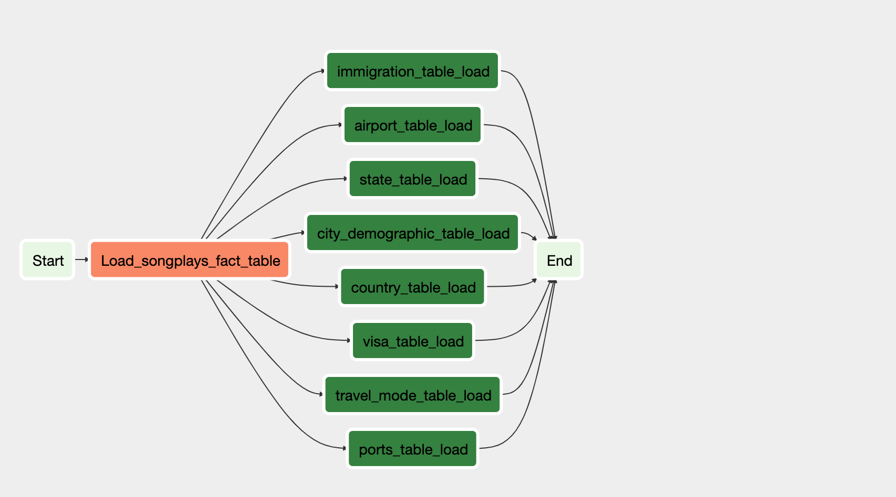

# Data Engineering Capstone Project: 

## Project Summary
Project Goal is to build an ETL pipeline to perform ETL Operations on Immigration Data to Provide Insights to an analyst about Immigration to different cities and countries through different means of transportation. The project uses pyspark to process data, creates a star schema and generate output in parquet files. Parquet Files can be latter transferred to storage like S3. Then it can be a load to Database or data warehouse for analytical operations.

## Datasets
Following datasets are used for this project:
- __I94 Immigration Data__: This data is retrieved from the US National Tourism and Trade Office and the source can be found [here](https://travel.trade.gov/research/reports/i94/historical/2016.html).
- __U.S. City Demographic Data__: This data comes from OpenSoft [here](https://public.opendatasoft.com/explore/dataset/us-cities-demographics/export/).
- __Airport Code Table__: This is a simple table of airport codes and corresponding cities that is retrieved from [here](https://datahub.io/core/airport-codes#data)

## DataBase Dicitonary
Start Schema Consist of Following Fact and dimension tables

`dim_city_demographics`:  
|-- port_code: varchar(50) (Primary key): i94port code  
|-- city_name: varchar(50): U.S. city name  
|-- state_code: varchar(50): two letter U.S. sate code  
|-- male_population: INT: total male population  
|-- female_population: INT: total female population  
|-- total_population: INT: total population  
|-- number_of_veterans: INT: number of veterans  
|-- num_foreign_born: INT: number of foreign born  

`dim_country`:  
|-- country_code: varchar(50) (Primary key): ISO counyry code  
|-- country_name: varchar(50): name of the country  

`dim_state`:  
|-- state_code: varchar(50) (Primary key): ISO mostly two letter sate code  
|-- state_name: varchar(50): name of the state  

`dim_visa`:  
|-- visa_type_id: varchar(50) (Primary key): visa type id, state visa class 
|-- visa_type: varchar(50): visa class name 

`dim_port`
|-- port_code: varchar(50) (Primary key): i94 port code  
|-- city_name: varchar(50): name of the city  
|-- state_code: varchar(50): ISO state code  

`dim_travel_mode`
|-- mode_id: varchar(50) (Primary key): travel mode in  
|-- mode_name: varchar(50): travel way air/sea/road  

`dim_airpot_codes`
|-- ident: varchar(50) (Primary key):
|-- type: varchar(50): airport type
|-- name: varchar(50): airport name
|-- elevation_ft: varchar(50): airport elevation in feet
|-- continent: varchar(50): continent of airport
|-- country_code:varchar(50): country code where airport is located 
|-- state_code: varchar(50): state code where airport is located 
|-- municipality: varchar(50): municipality code where airport is located 
|-- gps_code: varchar(50): airport gps code
|-- iata_code: varchar(50):
|-- local_code: varchar(50):
|-- latitude: varchar(50): airport latitude
|-- longitude: varchar(50): airport longitude

`fact_immigraions`:  
|-- cicid: varchar(50): id from sas file   
|-- entry_year: NUMERIC: 4 digit year  
|-- entry_month: varchar(50): numeric month  
|-- origin_country_code: varchar(50): i94 country code as per SAS Labels Descriptions file  
|-- port_code: varchar(50): i94port code as per SAS Labels Descriptions file  
|-- arrival_date: DATE: date of arrival in U.S.  
|-- travel_mode_code: varchar(50): code for travel mode of arrival as per SAS Labels Descriptions file  
|-- us_state_code: varchar(50): two letter U.S. state code  
|-- departure_date: DATE: departure date from U.S.  
|-- age: INT: age of the immigrant  
|-- visa_category_code: varchar(50): visa category code as per SAS Labels Descriptions file  
|-- occupation: varchar(50): occupation of immigrant  
|-- gender: varchar(50): gender of immigrant  
|-- birth_year: INT: birth year of immigrant  
|-- entry_date: DATE: Date to which admitted to U.S. (allowed to stay until)  
|-- airline: varchar(50): airline code used to arrive in U.S.  
|-- admission_number: varchar(50): admission number  
|-- flight_number: varchar(50): flight number  
|-- visa_type: varchar(50): visa type  

### Reasons for the model
I settled on the above model since I found that the common data field from all the various datasets is immigration data and with that I could be able to extrapolate the other data fields that I required for the data pipeline. With the fact and dimension tables, I utilized the star schema which is more suitable and optimized for OLAP (Online Analytical Processing) operations.

## USE CASES And Queries 
A few  queries that can be performed are are as follow
- Analyst Can determine tourist flow to a destination and provide safety and precaution.
- Which city was most visited in a specific month?
- Which port is mostly used for travel?
- Airport locations by city, country or continenta.
- Travelers Categories by Gender or visa type.
- From which country (or countries) travelers originate? Top countries of origin.
- Top countries from where travelers are coming? 

## Airflow Dag
Load output data to s3. Then s3 to Redshift
 

## ETL Steps
- Created Spark Session
- Parse Immigration Data Label file and parse labels ['I94MODE', 'I94VISA', 'I94ADDR', 'I94PORT', 'I94RES']
- Clean code/description of each label, drop duplicates and create Staging Views.
- port_name is combination of city and state_code, So split it into two columns for further joins.
- Read immigration data, clean data, transform dates into iso format and create staging view.
- Load City Demographics data, clean data and create staging view.
- Load Airport Code Data, divide coordinates as latitude and longitude, fetch State Code from region. and create staging view.
- Perform Data Quality checks on Staging views.
- Store Finalized staging data into Parquet File.
- Dag Transform data to s3 and further loads to Redshift for analytical purposes

## Tools and Technologies
- `Python3.7` Python as Main programming languag
- `Aparch Spark (Pyspark)`: I've chosen Apache Spark for this project due to it's parallelism and ability to handle large datasets. Immigrations full dataset contains ~40MM rows. I've used a mix of Pyspark's SQL and python libraries in this project.
- `S3 storage` Used S3 storage for processed output data files.
- `REDSHIFT` Redshift warehouse used to load final tables to perform analytical tasks.

## Approach To Other Scenarios

#### If the data was increased by 100x
We can add more worker nodes in cluster to process larger data. Another option is to use AWS EMR.

#### If the pipelines were run on a daily basis by 7am
Apache Airflow can be used to schedule a job at 7am daily which triggers Spark job.

#### If the database needed to be accessed by 100+ people
Parquet files can be loaded in Amazon Redshift as data warehouse. We can adjust Redshift nodes depending upon data size and access rate.

## Files Description
- `etl.py` contains etl logic
- `sql_queries.py` contains the SQL queries used in the ETL process.
- `conf.cfg` configuration file contains keys and path
- `capstone_dag` dag contains task to load data to s3 and then to Redshift
- `s3_to_redshift.py` plugin to load data from s3 to redshift
- `upload_to_s3.py` plugin to load data to s3

## To run
- Setup environment and add correct configuration and paths in conf.cfg
- run etl.py to perform etl pipeline and store out put in file
- Create Table according to given schema
- Run Dag to load data to redshift
